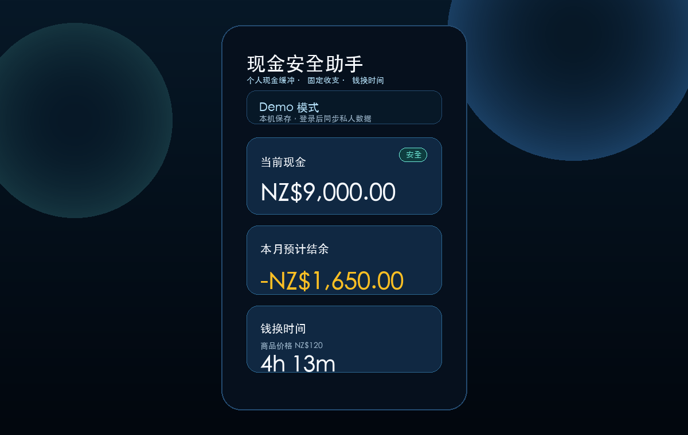

# Cash Safety Assistant / 现金安全助手



一个手机优先的个人现金安全 Demo，用来快速查看现金缓冲、固定收支、最近记录，以及“钱换时间”的工作时长估算。

前端可以直接部署到 GitHub Pages。项目没有后端服务器，不使用 Firebase Admin SDK，也不会把账号密码写进代码。

## Demo 模式

未登录时，网站会进入 Demo 模式：

> 当前为 Demo 模式。数据只保存在本机浏览器，登录后可同步保存你的私人数据。

Demo 模式默认数据：

- 当前存款：9000
- 安全线：3000
- 家庭支持：0
- 工资：0
- 额外收入：0
- 房租：1400
- 水电网预计：250
- 税后时薪：28.42
- 每天工作小时：8
- 每周工作天数：5

未登录用户可以修改 Demo 数据，但只会保存到当前浏览器的 `localStorage`，不会上传到云端。

## 注册登录

本项目使用 Firebase Authentication 的邮箱密码登录：

- 未登录：显示 Demo 模式、登录按钮、注册按钮
- 注册：邮箱、密码、确认密码
- 登录：邮箱、密码
- 登录后：顶部显示当前登录邮箱和退出登录按钮
- 退出后：立即回到 Demo 模式，不再显示刚才账号的私人数据

## 数据隐私

登录后的数据保存在 Firestore 当前用户路径下：

- Profile：`users/{uid}/profile/main`
- Records：`users/{uid}/records/{recordId}`

`profile/main` 字段：

- `currentSavings`
- `safetyLine`
- `familySupport`
- `salary`
- `extraIncome`
- `rent`
- `utilitiesInternet`
- `netHourlyWage`
- `dailyWorkHours`
- `weeklyWorkDays`
- `showTimeCard`
- `updatedAt`

`records/{recordId}` 字段：

- `id`
- `type`: `income` 或 `expense`
- `amount`
- `name`
- `date`
- `createdAt`

不要把真实个人数据写进代码。公开仓库里只应保留 Demo 数据。

## Firebase 配置方式

1. 进入 Firebase Console。
2. 创建或选择一个 Firebase Project。
3. 添加 Web App。
4. 开启 Authentication -> Sign-in method -> Email/Password。
5. 创建 Firestore Database。
6. 复制 Firebase Web App 配置。
7. 修改 `firebase-config.js`：

```js
window.CASH_SAFETY_FIREBASE_CONFIG = {
  apiKey: "YOUR_API_KEY",
  authDomain: "YOUR_PROJECT_ID.firebaseapp.com",
  projectId: "YOUR_PROJECT_ID",
  storageBucket: "YOUR_PROJECT_ID.firebasestorage.app",
  messagingSenderId: "YOUR_MESSAGING_SENDER_ID",
  appId: "YOUR_APP_ID"
};
```

Firebase Web 配置可以放在前端代码里。它不是账号密码，也不是 Admin 密钥。真正的数据隔离依赖 Firestore Security Rules。

## Firestore Security Rules

必须设置下面的规则，防止用户读取或写入其他用户的数据：

```js
rules_version = '2';

service cloud.firestore {
  match /databases/{database}/documents {
    match /users/{userId}/{document=**} {
      allow read, write: if request.auth != null && request.auth.uid == userId;
    }
  }
}
```

## GitHub Pages 部署方式

1. 把本项目上传到 GitHub 仓库。
2. 进入仓库 Settings -> Pages。
3. Source 选择 `Deploy from a branch`。
4. Branch 选择 `main`，目录选择 `/(root)`。
5. 保存后等待 GitHub Pages 发布。

当前项目是纯静态前端，适合直接部署到 GitHub Pages。

## 免责声明

This is not financial advice.

本项目只用于个人现金记录和 Demo 展示，不构成任何财务建议。
